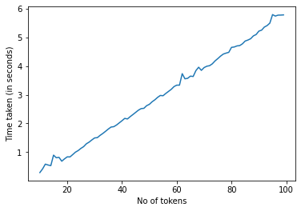

# Naija Segmenter

Simple machine learning based app/api for segmenting multilingual text by language (mostly Nigerian languages). The interface was built with [Gradio](https://gradio.app/).  
Supported languages/classes are:  
1. Igbo  
2. Hausa  
3. Igede  
4. Kanuri  
5. Ibibio  
6. Nigerian pidgin  
7. Efik  
8. Igala  
9. Fulfude-adamawa  
10. Idoma  
11. Tiv  
12. Yoruba  
13. English  
14. Ebira  
15. Others( any other language)   

**LIVE DEMO:** [Demo](https://naijasegmenter.herokuapp.com/)  

## How it works  
The program is works by using naive bayes model language classifier to get the language for various segments of the input text.  
The langage classifier in this program was trained with texts from [bible.com](https://www.bible.com/) and BBC ([BBC](https://www.bbc.com/), [BBC Pidgin](https://www.bbc.com/pidgin), [BBC Hausa](https://www.bbc.com/hausa), [BBC Igbo](https://www.bbc.com/igbo), [BBC Yoruba](https://www.bbc.com/yoruba)).  

The n-gram (default: 4-gram) of the input texts are passed through the classifier to generate the probabilities for each language class (I used Scikit-learn's Naive Bayes model's `predict_proba` for simplicity but NB is a poor estimator and the probabilities don't really mean much, but are still sufficient for this task).  
  The probabilites are added to the probability array for each token of the text in the ngram. After this the language class with the  highest probability is selected for each token in the text. Similar consecutive classes are then assigned to the same span. Smoothening is also applied i.e spans with length less than the `k` parameter (defaults to 6) are reassigned to the previous span's class.  

## PERFORMANCE
The program showed pretty good accuracy during tests.  

Time taken to segment a piece of text increases linearly with the number of tokens in the text.  
